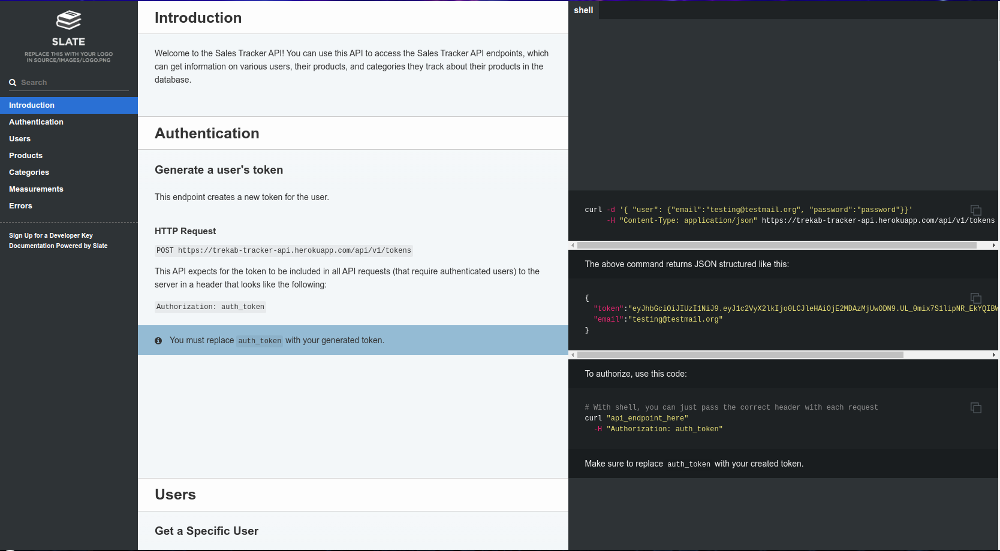

# Sales Tracker API

> This is an API for a `sales tracker` client that is aimed at enabling users to track various aspects about their products/sales e.g. orders, inventory, sales made, e.t.c. 

## Built With

- Ruby on Rails

## Documentation
[Documentation Link](https://trekab.github.io/my-tracker-api-docs/)

## Getting Started

To get a local copy up and running follow these simple example steps.

To get a local copy up and running follow these simple example steps.
- `git clone git@github.com:trekab/my-tracker-api.git`

Then you browse to the folder and exucute the following commands
- `cd my-tracker-api`
- run `bundle install`
- run `rails db:create`
- run `rails db:migrate`
- run `rails s` and test out the `endpoints` from your preferred client.

### To run tests:
- run `rails test`

## Authors

👤 **Treasure Kabareebe**

- Github: [@trekab](https://github.com/trekab)
- Twitter: [@TKabareebe](https://twitter.com/TKabareebe)
- Linkedin: [Treasure Kabareebe](https://www.linkedin.com/in/treasure-kabareebe/)

## 🤝 Contributing

Contributions, issues and feature requests are welcome!

Feel free to check the [issues page](issues/).

## Show your support

Give a ⭐️ if you like this project!

## Acknowledgments

- [Microverse](https://www.microverse.org/)

## 📝 License

This project is [MIT](lic.url) licensed.
